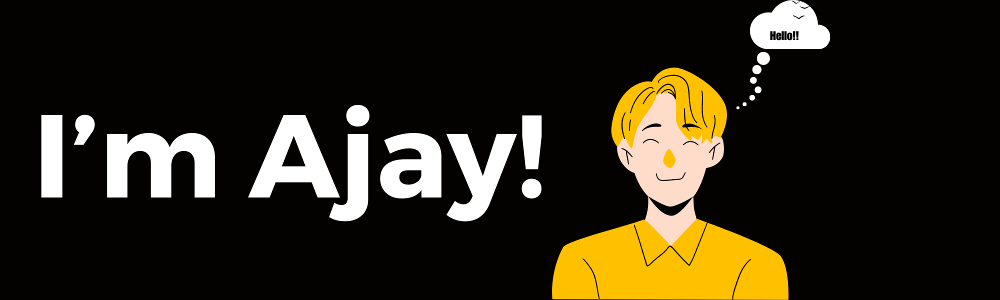

# 💫 About Me:
🌱 I’m currently working on [KeenCode.](https://www.youtube.com/channel/UCOMhPc0ggdhZ9GKqsLAkp4A?sub_confirmation=1) a YouTube Channel. 🤔 My research interests are with Small Language Model (This isn't existed yet 😂) 💬 Ask me about anything, I would like to answer. 📫 Please email via ajaykum11012@gmail.com to reach me. 👯 I’m looking to collaborate on new open projects on JavaScript/rust 📫 How to reach me: LinkedIn, Email, Instagram 😄 Pronouns: Aj ⚡ Fun fact: I am a fan of bit shifting

## 🌐 Socials:
    

# 💻 Tech Stack:
         
# 📊 GitHub Stats:
 
 

## 🏆 GitHub Trophies

### ✍️ Random Dev Quote

### 🔝 Top Contributed Repo

### 😂 Random Dev Meme

---
Thanks For Coming Here 🍻 |
Created on 💖 [GPRM](https://gprm.itsvg.in/)
